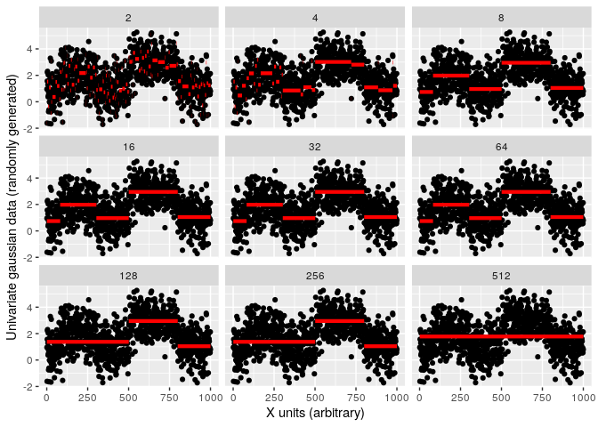

Tests for GSOC 2020 - Constrained Changepoint GUI
================
Julian Stanley
February-March 2020

[](https://julianstanley.com)
[](https://github.com/rstats-gsoc/gsoc2020/wiki/Constrained-changepoint-GUI)
[](https://summerofcode.withgoogle.com/)

For an example of prior Shiny-related work, see the “inst” folder within
the “SensorOverlord” repo on my account, [found
here](https://github.com/julianstanley/SensorOverlord/tree/master/inst/shinyApp).

Please feel free to contact me at julianstanleya \[at\] gmail or
stanley.ju \[at\] northeastern \[dot\] edu.

# Overview

This repository and this accompanying README is a set of tests for
Google Summer of Code (GSOC) 2020.

These tests serve to show that I have the basic competencies required to
make a GUI for the [gfpop package](https://github.com/vrunge/gfpop),
which detects changepoints in univariate time series constrained to a
graph structure.

# Easy Test

This test requires that I download the gfpop package, run the code in
the vignette, change the penalty parameter, and make a multi-panel
ggplot that shows how the model changes as the penalty parameter is
varied. It specifies that there should be one panel for each penalty
parameter value.

``` r
library(gfpop)
library(ggplot2)
library(plyr)

# Simulate univariate gaussian data
n <- 1000
myData <- dataGenerator(n, c(0.1,0.3,0.5,0.8,1), c(1,2,1,3,1), sigma = 1)

# A function for computing the location of changepoints at a given penalty parameter
changepoint_locs <- function(penalty, data = myData) {
    myGraph <- graph(penalty = penalty, type = "updown")
    model <- gfpop(data = data, mygraph = myGraph, type = "mean")
    num_changepoints <- length(model$changepoints)
    this_data <- data.frame(penalty = rep(penalty, num_changepoints), 
                            changepoint = model$changepoints,
                            changepoint_end = c(1, model$changepoints[1:num_changepoints-1]),
                            y = model$parameters)
    return(this_data)
}

# Generate penalities and data (note: no particular reason for the chosen 
# penalities. Just seemed to show the trend well.)
penalities <-  as.double(2^(1:9))
my_changepoints <- plyr::ldply(lapply(penalities, changepoint_locs), rbind)

# Show the results!
ggplot(my_changepoints) +
    facet_wrap(penalty ~ ., ncol = 3) +
    geom_point(data = data.frame(myData), aes(x = rep(1:1000, length(penalities)), y = myData)) +  
    geom_segment(aes(x = changepoint, xend = changepoint_end, y = y, yend = y), size = 1.5, col = "red") +
    xlab("X units (arbitrary)") +
    ylab("Univariate gaussian data (randomly generated)")
```

<!-- -->

Hopefully, this plot helps you to see the general trend of the effect of
the penalty on gfpop. At low penalty values, the algorithm is grossly
overfit–for example, at a penalty of
, gfpop detects
changepoints at dozens of points throughout the dataset.

Around penalities
![\[8,64\]](https://latex.codecogs.com/png.latex?%5B8%2C64%5D "[8,64]"),
gfpop is relatively stable. This is good news, since the “rule of thumb”
penalty of ") for this dataset would be  \\approx 13.81"), right within this range.

At a penalty above ,
gfpop begins to be underfit to the dataset. For example, at
, gfpop does not
predict any changepoints.

# Medium Test

This test requires that I make a shiny app with an input that allows the
user to select the penalty parameter in that dataset, and shows a ggplot
of the data and model with that penalty parameter.

To run:

``` r
if(!require("shiny")) install.packages("shiny")
shiny::runGitHub("gsoc2020_juliantest", "julianstanley", subdir = "app")
```

<!-- -->

# Hard Test

For this test, I will write a D3.js data visualization in which the user
can hover over one displayed item and see it highlighted, along with
other items.

When working in R, I will often use Plotly to render d3.js interactive
plots (Plotly is built on top of d3.js, but specalized for plotting).
It’s much easier for most plots, especially in R because of its
integration with the ggplot2 library.

Note to mentors: I am more than happy to re-create this plot in pure d3,
if necessary. Please feel free to reach out to me and request that, if
that can help to convince you that I’m serious about this project\! :)

To make my visualization, I first merged the gfpop input data with the
changepoint results: each point is within a certain “changepoint
region”, that might be interesting to endusers.

When you hover over a given datapoint, the D3 visualization will give
you the coordinates of that datapoint, as well as information about the
changepoint region in which that datapoint falls.

The visualization is included in the shiny app, which can be run just as
before:

``` r
if(!require("shiny")) install.packages("shiny")
shiny::runGitHub("gsoc2020_juliantest", "julianstanley", subdir = "app")
```


